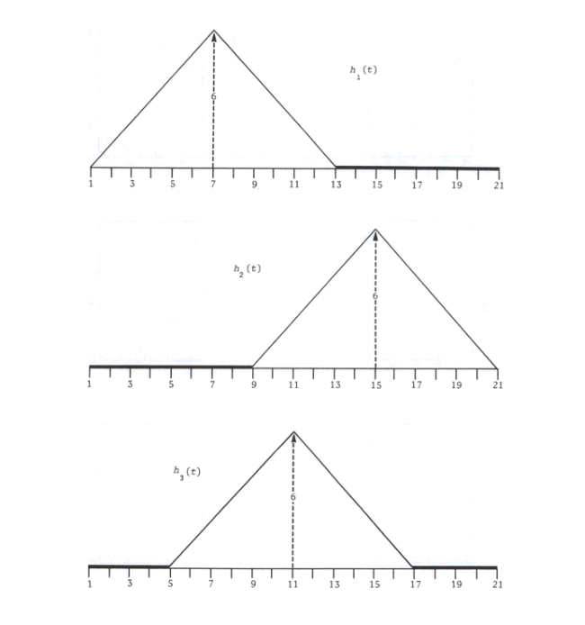
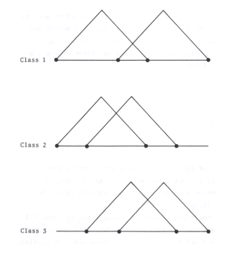

# Waveform Clustering and Unsupervised Learning System

## Overview

---

This project implements a structured data mining pipeline for the preprocessing, transformation, clustering, and analysis of the [Waveform Database Generator (Version 1) dataset](https://archive.ics.uci.edu/dataset/107/waveform+database+generator+version+1).

The system is designed to support unsupervised learning tasks, where inherent structures in the data are discovered without the use of predefined class labels. The dataset consists of three waveform classes described by 21 numerical attributes, all of which include noise, making it suitable for evaluating clustering algorithms under realistic conditions.

The pipeline is organized into multiple stages:

1. Data Preprocessing: Cleaning, normalization, and transformation of raw data
2. Feature Preparation: Structuring the dataset for unsupervised learning
3. Clustering: Application of multiple clustering algorithms
4. Evaluation: Quantitative assessment using clustering validation metrics
5. Visualization and Analysis: Interpretation of discovered patterns

The project follows a modular architecture to ensure reproducibility, clarity, and separation of concerns across all stages of the data mining workflow.

---

## Dataset Description

The Waveform Database Generator (Version 1) dataset is a synthetic dataset widely used in machine learning research.

- Number of Classes: 3 (not used for unsupervised training)
- Number of Features: 21 numerical attributes
- Noise: All features include noise components
- Task Type: Unsupervised learning (clustering)

Although the dataset includes class labels, they are intentionally excluded during the clustering phase and may only be used for interpretation and comprarion of clustering results.

Each data point or object in the dataset represents a 21-dimensional vector *x*, where *x = (x~1~, x~2~, . . . , x~21~)*. Conceptually, each vector is a noisy waveform sampled at 21 points in time.

According to the authors of this dataset (Breiman & Stone, 1984), there are three prototypes of waveforms that are the basis of the problem: *h~1~(t)*, *h~2~(t)*, and *h~3~(t)*. These prototype classes are graphed below in Figure 1.

### Figure 1: Prototype Waveforms *h~1~(t)*, *h~2~(t)*, and *h~3~(t)*



However, to make the dataset more realistic the three classes that a clustering algorithm must identify are not pure waveforms, instead they are mixtures of two waveforms and noise. Each class is generated in the following way.

#### Class 1 Objects

*xₘ = u·h₁(m) + (1 - u)·h₂(m) +  ε~m~*

#### Class 2 Objects

*xₘ = u·h₁(m) + (1 - u)·h₃(m) + ε~m~*

#### Class 3 Objects

*xₘ = u·h₂(m) + (1 - u)·h₃(m) + ε~m~*

In these class definitions *xₘ* is a 21-attribute vector that represents a point in the dataset beloging to class *i*, *u* is a random mixing coefficient that has a value in the interval [0, 1], and m is the index of the attribute or the position at which the waveform was sampled (m = 1, 2, ..., 21), and ε~m~ is random noise added to attribute m, which is calculated from a normal distribution with a mean of 0 and a variance of 1. The purpose of the noise is to distort the waveform slightly. Does the noise bias the data? No, it does not because on average noise is 0 and noise strenght is consistent across data due to the variance value of 1.

Thus, class 1 objects are a mix of h~1~(t) and h~2~(t) waveforms and noise. Class 2 objects are a mix of h~1~(t) and h~3~(t) waveforms and noise. Class 3 objects are a mix of h~2~(t) and h~3~(t) waveforms and noise. In other words each waveform sample in the dataset is a superposition of two prototype waveforms and noise. These classes are shown in Figure 2.

### Figure 2: Waveform Classes



---

## Tools and Technologies

### Programming Language

Python 3.10+

---

## Development Environment Configuration

### 1. Repository Setup

Clone the repository and navigate to the project root:

```bash
git clone https://github.com/AshleyTRS/classification-project.git
cd classification-project
```

Create your own branch:

```bash
git checkout -b <your-branch-name> 
```

### 2. Python Virtual Environment

A virtual environment is recommended to isolate project dependencies.

#### Windows

```bash
python -m venv .venv
.venv\Scripts\activate
```

#### Linux / macOS

```bash
python -m venv venv
source venv/bin/activate
```

### 3. Dependency Installation

Install the required libraries using the provided requirements file:

```bash
pip install -r requirements.txt
```

---

## Project Structure

```bash
data/
  ├── raw/               Original dataset
  └── preprocessed/      Cleaned and transformed data

results/                 Outputs (plots, metrics, cluster assignments)

src/
  ├── preprocessing/     Data cleaning, normalization, transformation
  ├── clustering/        Clustering algorithms
  │   ├── kmeans/
  │   ├── agglomerative/
  │   └── dbscan/
  ├── evaluation/        Clustering evaluation metrics
  └── utils/             Shared utilities (e.g., visualization, helpers)
  ```

  ---

## Data

In the project directory, the script `data/raw/data-loader.py` is used to download the dataset from the UCI repository for training purposes. This script creates two `csv` files: `X.csv` and `Y.csv` which represent the raw dataset without classfication labels and the classfification labels respectively.
